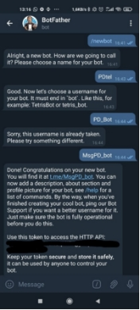
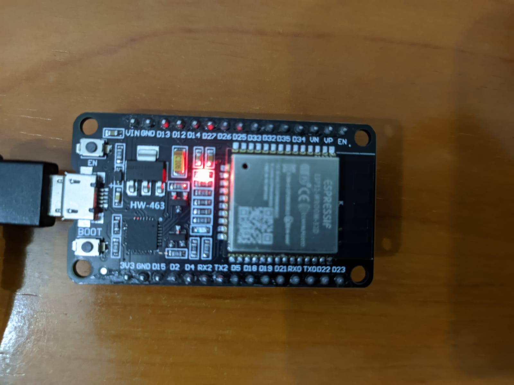
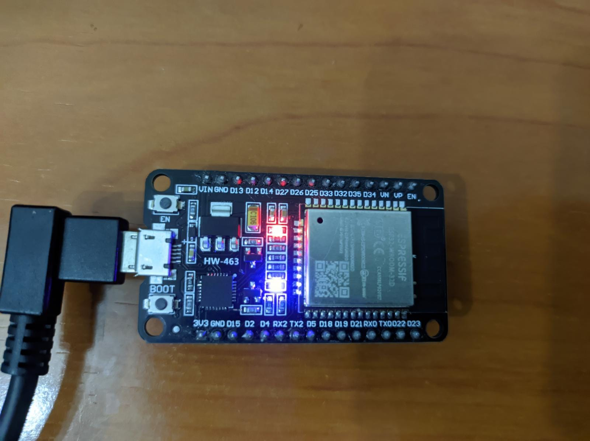

# Proyecto final Procesadores digitales: Bot de telegram
## **Introducción**
Con ayuda de la conexión wifi y la facilidad que tiene telegram de hacer bots se podrá hacer un bot funcional conectado vía un http api. Con él se podrán hacer distintas funcionalidades. En este caso se usará el led incorporado en la esp32 para abrirla y cerrarla des de telgram.
## **Tecnologías**
#### Elementos necesarios para la práctica

\- Esp32-Wroom-32D

Software

\- Visual studio

\- PlatformIO

\- Arduino

\- Telegram
## **Setup y Funcionamiento**

#### Preparación previa PlatformIO
<p align="center">
  
</p>

En primer lugar, se tendrá que crear un bot mediante la aplicación *Telegram*, para hacerlo habrá que buscar el creador de bot de *Telegram* llamado *botFather.* 

A continuación, se tendrá que inicializar mediante el comando */start* y mostrara los comandos que se pueden usar, se usará el comando */newbot* para crear un nuevo bot. *BotFather* pedirá el nombre el identificador del bot y el nombre.

Finalmente se entregará una API que servirá para conectar el bot de Telegram con la esp32.

Mediante el uso de otro bot llamado *IDbot* se dará una identificación del Telegram personal con el fin de limitar la entrada del bot únicamente al usuario que está realizando las pruebas


<p align="left">
  
  
</p>


#### Implementación y código

Como en las prácticas se empieza por crear un proyecto nuevo mediante *PlatformIO*.

```cpp
#include <Arduino.h>
#ifdef ESP32
  #include <WiFi.h>
#else
  #include <ESP8266WiFi.h>
#endif
#include <WiFiClientSecure.h>
#include <UniversalTelegramBot.h> 
#include <ArduinoJson.h>

// Replace with your network credentials
const char* ssid = "Mi11lite5g";
const char* password = "123456789";

// Initialize Telegram BOT
#define BOTtoken "1860656007:AAF46qcXFcgjtCyXjEmP7Vo84kvCeDaiAT8"  // your 
#define CHAT_ID "1666493658"

#ifdef ESP8266
  X509List cert(TELEGRAM_CERTIFICATE_ROOT);
#endif

WiFiClientSecure client;
UniversalTelegramBot bot(BOTtoken, client);

// Checks for new messages every 1 second.
int botRequestDelay = 1000;
unsigned long lastTimeBotRan;

const int ledPin = 2;
bool ledState = LOW;
```
Básicamente aquí se definen las cabeceras y todas las variables que se van a utilizar. Se tendrán que añadir unas librerías concretas de *Telegram* que servirán para poder operar con los bots de *Telegram* y comprender el lenguaje.

Por otro lado, se usará la librería *arduinojson* que sirve básicamente para comunicar proyectos que incorporan comunicación web, en este caso se utiliza el wifi para utilizar el bot en *Telegram*.

Es importante mencionar que se tendrán que añadir las librerias mediante la herramienta de *PlatformIO*, se tendrán que descargar y añadir al proyecto.

Las cabeceras de Wifi que ya se usaron en prácticas pasadas, hay también librerías especificas para otro tipo de procesador que realmente no se usarán como por ejemplo **_#include <ESP8266WiFi.h>_**. Las variables relevantes son las del identificador del WIFI, su contraseña y, como ya se ha comentado antes las variables del identificador API del bot y el identificador del telegram propio. Se definirá una variable de tiempo que servirá para tener espacio de tiempo en las acciones del bot. Y la variable del Pin que se usará.
``` cpp
void handleNewMessages(int numNewMessages) {
  Serial.println("handleNewMessages");
  Serial.println(String(numNewMessages));

  for (int i=0; i<numNewMessages; i++) {
    // Chat id of the requester
    String chat_id = String(bot.messages[i].chat_id);
    if (chat_id != CHAT_ID){
      bot.sendMessage(chat_id, "Unauthorized user", "");
      continue;
    }
    
    // Print the received message
    String text = bot.messages[i].text;
    Serial.println(text);

    String from_name = bot.messages[i].from_name;

    if (text == "/start") {
      String welcome = "Welcome, " + from_name + ".\n";
      welcome += "Use the following commands to control your outputs.\n\n";
      welcome += "/led_on to turn GPIO ON \n";
      welcome += "/led_off to turn GPIO OFF \n";
      welcome += "/state to request current GPIO state \n";
      bot.sendMessage(chat_id, welcome, "");
    }

    if (text == "/led_on") {
      bot.sendMessage(chat_id, "LED state set to ON", "");
      ledState = HIGH;
      digitalWrite(ledPin, ledState);
    }
    
    if (text == "/led_off") {
      bot.sendMessage(chat_id, "LED state set to OFF", "");
      ledState = LOW;
      digitalWrite(ledPin, ledState);
    }
    
    if (text == "/state") {
      if (digitalRead(ledPin)){
        bot.sendMessage(chat_id, "LED is ON", "");
      }
      else{
        bot.sendMessage(chat_id, "LED is OFF", "");
      }
    }
  }
}
```
Esta función se encargará de gestionar todos los mensajes que le llegan al bot y mediante las librerías importadas de telegram se podrá comunicar telegram con la esp32. En este caso habrá un contador que cada vez que el usuario escriba una palabrá irá sumando y servirá para ir repitiendo el proceso de comandos.

El comando */start* servirá para iniciar el bot, este mostrará el menú en el chat con tres opciones */led_on*, */led_off* y */status*. Como su nombre indica el */led_on* servirá para hacer que el robot encienda el led y */led_off* para que lo apague, en caso de saber si está encendido o apagado se puede usar el comando */status*.
``` cpp
void setup() {
  Serial.begin(115200);

  #ifdef ESP8266
    configTime(0, 0, "pool.ntp.org");      // get UTC time via NTP
    client.setTrustAnchors(&cert); // Add root certificate for api.telegram.org
  #endif

  pinMode(ledPin, OUTPUT);
  digitalWrite(ledPin, ledState);
  
  // Connect to Wi-Fi
  WiFi.mode(WIFI_STA);
  WiFi.begin(ssid, password);
  #ifdef ESP32
    client.setCACert(TELEGRAM_CERTIFICATE_ROOT); // Add root certificate for api.telegram.org
  #endif
  while (WiFi.status() != WL_CONNECTED) {
    delay(1000);
    Serial.println("Connecting to WiFi..");
  }
  // Print ESP32 Local IP Address
  Serial.println(WiFi.localIP());
}
```
En el setup se configurará lo que viene a ser los pines de la placa, la conexión al wifi y la conexión al bot de *Telegram*. 
``` cpp
void loop() {
  if (millis() > lastTimeBotRan + botRequestDelay)  {
    int numNewMessages = bot.getUpdates(bot.last_message_received + 1);

    while(numNewMessages) {
      Serial.println("got response");
      handleNewMessages(numNewMessages);
      numNewMessages = bot.getUpdates(bot.last_message_received + 1);
    }
    lastTimeBotRan = millis();
  }
}
```
Finalmente en el loop se utilizará la función *millis()* para saber el tiempo actual. Con esto se calcula el tiempo que pasa entre cada proceso de consulta. *numNewMessages* se usa para obtener el número de mensajes que ha recibido el bot, esto servirá para situar y repetir la serie de comandos. Mientras se van enviando mensajes el bot sigue funcionando.
## **Código Completo**
```cpp
#include <Arduino.h>
#ifdef ESP32
  #include <WiFi.h>
#else
  #include <ESP8266WiFi.h>
#endif
#include <WiFiClientSecure.h>
#include <UniversalTelegramBot.h>  
#include <ArduinoJson.h>

// Replace with your network credentials
const char* ssid = "Mi11lite5g";
const char* password = "123456789";

// Initialize Telegram BOT
#define BOTtoken "1860656007:AAF46qcXFcgjtCyXjEmP7Vo84kvCeDaiAT8"  // your 
#define CHAT_ID "1666493658"

#ifdef ESP8266
  X509List cert(TELEGRAM_CERTIFICATE_ROOT);
#endif

WiFiClientSecure client;
UniversalTelegramBot bot(BOTtoken, client);

// Checks for new messages every 1 second.
int botRequestDelay = 1000;
unsigned long lastTimeBotRan;

const int ledPin = 2;
bool ledState = LOW;

// Handle what happens when you receive new messages
void handleNewMessages(int numNewMessages) {
  Serial.println("handleNewMessages");
  Serial.println(String(numNewMessages));

  for (int i=0; i<numNewMessages; i++) {
    // Chat id of the requester
    String chat_id = String(bot.messages[i].chat_id);
    if (chat_id != CHAT_ID){
      bot.sendMessage(chat_id, "Unauthorized user", "");
      continue;
    }
    
    // Print the received message
    String text = bot.messages[i].text;
    Serial.println(text);

    String from_name = bot.messages[i].from_name;

    if (text == "/start") {
      String welcome = "Welcome, " + from_name + ".\n";
      welcome += "Use the following commands to control your outputs.\n\n";
      welcome += "/led_on to turn GPIO ON \n";
      welcome += "/led_off to turn GPIO OFF \n";
      welcome += "/state to request current GPIO state \n";
      bot.sendMessage(chat_id, welcome, "");
    }

    if (text == "/led_on") {
      bot.sendMessage(chat_id, "LED state set to ON", "");
      ledState = HIGH;
      digitalWrite(ledPin, ledState);
    }
    
    if (text == "/led_off") {
      bot.sendMessage(chat_id, "LED state set to OFF", "");
      ledState = LOW;
      digitalWrite(ledPin, ledState);
    }
    
    if (text == "/state") {
      if (digitalRead(ledPin)){
        bot.sendMessage(chat_id, "LED is ON", "");
      }
      else{
        bot.sendMessage(chat_id, "LED is OFF", "");
      }
    }
  }
}

void setup() {
  Serial.begin(115200);

  #ifdef ESP8266
    configTime(0, 0, "pool.ntp.org");      // get UTC time via NTP
    client.setTrustAnchors(&cert); // Add root certificate for api.telegram.org
  #endif

  pinMode(ledPin, OUTPUT);
  digitalWrite(ledPin, ledState);
  
  // Connect to Wi-Fi
  WiFi.mode(WIFI_STA);
  WiFi.begin(ssid, password);
  #ifdef ESP32
    client.setCACert(TELEGRAM_CERTIFICATE_ROOT); // Add root certificate for api.telegram.org
  #endif
  while (WiFi.status() != WL_CONNECTED) {
    delay(1000);
    Serial.println("Connecting to WiFi..");
  }
  // Print ESP32 Local IP Address
  Serial.println(WiFi.localIP());
}

void loop() {
  if (millis() > lastTimeBotRan + botRequestDelay)  {
    int numNewMessages = bot.getUpdates(bot.last_message_received + 1);

    while(numNewMessages) {
      Serial.println("got response");
      handleNewMessages(numNewMessages);
      numNewMessages = bot.getUpdates(bot.last_message_received + 1);
    }
    lastTimeBotRan = millis();
  }
}
```


## **Conclusión**
Se ha podido comprovar que el programa funciona correctamente, en este caso no se ha usado ningun led externo simplemente el que ya viene a la placa. Esto se puede ver en las imagenes que se muestran al final.
## **Referencias**
<https://github.com/witnessmenow/Universal-Arduino-Telegram-Bot/>

https://randomnerdtutorials.com/telegram-control-esp32-esp8266-nodemcu-outputs

## **Imágenes de la práctica**
<p align="right">
  
  Estado led off
</p>
<p align="right">
  
</p>
Estado led on
<p align="right">
  
</p>
Prespectiva mensajes de telegram