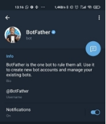
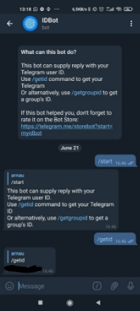
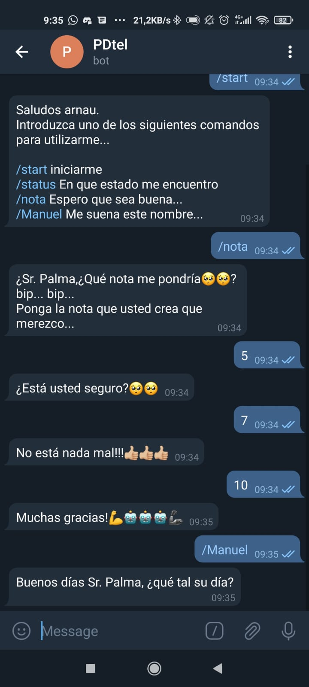
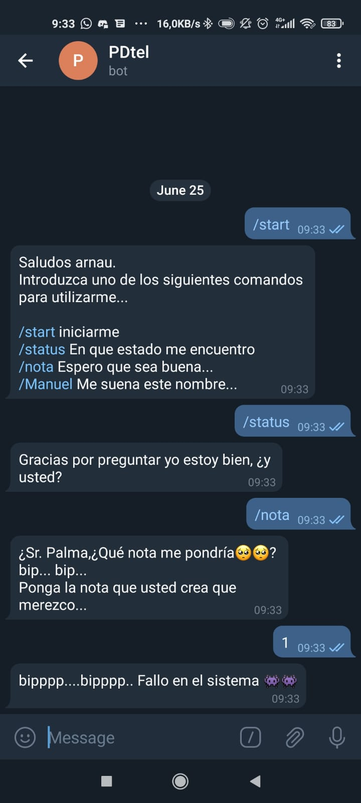

# Proyecto final Procesadores digitales: Bot de telegram
## **Introducción**
Con ayuda de la conexión wifi y la facilidad que tiene telegram de hacer bots se podrá hacer un bot funcional conectado vía un http api. Con él se podrán hacer distintas funcionalidades. En este caso se usará una lista de comandos que se ha hecho por cuenta propia basado en el github de un usuario.
## **Tecnologías**
#### Elementos necesarios para la práctica

\- Esp32-Wroom-32D

Software

\- Visual studio

\- PlatformIO

\- Arduino

\- Telegram
## **Setup y Funcionamiento**

#### Preparación previa PlatformIO
<p align="center">
  
</p>

En primer lugar, se tendrá que crear un bot mediante la aplicación *Telegram*, para hacerlo habrá que buscar el creador de bot de *Telegram* llamado *botFather.* 

A continuación, se tendrá que inicializar mediante el comando */start* y mostrara los comandos que se pueden usar, se usará el comando */newbot* para crear un nuevo bot. *BotFather* pedirá el nombre el identificador del bot y el nombre.

Finalmente se entregará una API que servirá para conectar el bot de Telegram con la esp32.


<p align="center">
  
</p>


#### Implementación y código

Como en las prácticas se empieza por crear un proyecto nuevo mediante *PlatformIO*.

```cpp
#include <Arduino.h>
#ifdef ESP32
  #include <WiFi.h>
#else
  #include <ESP8266WiFi.h>
#endif
#include <WiFiClientSecure.h>
#include <UniversalTelegramBot.h>  // Universal Telegram Bot Library written by Brian Lough: https://github.com/witnessmenow/Universal-Arduino-Telegram-Bot
#include <ArduinoJson.h>

// Wifi network station credentials
#define WIFI_SSID "Mi11lite5g"
#define WIFI_PASSWORD "123456789"
// Telegram BOT Token (Get from Botfather)
#define BOT_TOKEN "1860656007:AAF46qcXFcgjtCyXjEmP7Vo84kvCeDaiAT8"

const unsigned long BOT_MTBS = 1000; // mean time between scan messages

unsigned long bot_lasttime; // last time messages' scan has been done
WiFiClientSecure secured_client;
UniversalTelegramBot bot(BOT_TOKEN, secured_client);
```
Se definen las cabeceras y todas las variables que se van a utilizar. Se tendrán que añadir unas librerías concretas de *Telegram* que servirán para poder operar con los bots de *Telegram* y comprender el lenguaje.

Por otro lado, se usará la librería *arduinojson* que sirve básicamente para comunicar proyectos que incorporan comunicación web, en este caso se utiliza el wifi para utilizar el bot en *Telegram*.

Es importante mencionar que se tendrán que añadir las librerias mediante la herramienta de *PlatformIO*, se tendrán que descargar y añadir al proyecto. También se usarán las cabeceras de WIFI usadas en prácticas anteriores

x Las variables relevantes son las del identificador del WIFI, su contraseña y, como ya se ha comentado antes las variables del identificador API del boto. Se definirá una variable de tiempo que servirá para tener espacio de tiempo en las acciones del bot.
``` cpp
void handleNewMessages(int numNewMessages)
{
  Serial.print("handleNewMessages");
  Serial.println(numNewMessages);
  
  String answer, aux;
  for (int i = 0; i < numNewMessages; i++){
  
  
    telegramMessage &msg = bot.messages[i];
    Serial.println("Received " + msg.text);
    if(msg.text=="1" or msg.text=="2" or msg.text=="3" or msg.text=="4" or msg.text=="5" or msg.text=="6" or msg.text=="7" or msg.text=="8" or msg.text=="9" or msg.text=="10" or msg.text=="0"){
       answer.clear();
      Serial.println("Received"  + msg.text);
         if(msg.text=="1" or msg.text=="2" or msg.text=="3" or msg.text=="4" or msg.text=="5" or msg.text=="6" or msg.text=="7" or msg.text=="8" or msg.text=="9" or msg.text=="10" or msg.text=="0"){

           if(msg.text=="0" or msg.text=="1" or msg.text=="2" or msg.text=="3" or msg.text=="4"){
            answer = "bipppp....bipppp.. Fallo en el sistema 👾👾";
          }
          else if(msg.text=="5" or msg.text=="6"){
            answer = "¿Está usted seguro?🥺🥺";
          }
           else if(msg.text=="7" or msg.text=="8"){
             answer="No está nada mal!!!👍🏼👍🏼👍🏼" ; 
           }
           else if(msg.text=="9" or msg.text=="10"){

             answer= "Muchas gracias!💪🤖🤖🤖🦾"; 
           }
        }else if(!(msg.text=="0" and msg.text=="10")) {answer= "La nota que ha introducido no es correcta vuelve a intentarlo";}
        bot.sendMessage(msg.chat_id, answer, "Markdown");
        aux.clear();

    }else if (msg.text == "/start"){
      answer = "Saludos " + msg.from_name + ".\n";
      answer += "Introduzca uno de los siguientes comandos para utilizarme... \n\n";
      answer += "/start iniciarme \n";
      answer += "/status En que estado me encuentro \n";
      answer += "/nota Espero que sea buena... \n";
      answer += "/Manuel Me suena este nombre...\n";
      bot.sendMessage(msg.chat_id, answer, "Markdown");}

    else if (msg.text == "/status"){
      answer = "Gracias por preguntar yo estoy bien, ¿y usted?";
      bot.sendMessage(msg.chat_id, answer, "Markdown");
      }
     else if (msg.text == "/Manuel"){
      answer = "Buenos días Sr. Palma, ¿qué tal su día?";
      bot.sendMessage(msg.chat_id, answer, "Markdown");}
      else if (msg.text == "/nota"){
      answer = "¿Sr. Palma,¿Qué nota me pondría🥺🥺? bip... bip... \nPonga la nota que usted crea que merezco...";
      bot.sendMessage(msg.chat_id, answer, "Markdown");  
     aux="/nota";
     }
    else
      { answer = "Error comando no encontrado";
       bot.sendMessage(msg.chat_id, answer, "Markdown");}

   
  
  }
}
```
Esta función se encargará de gestionar todos los mensajes que le llegan al bot y mediante las librerías importadas de telegram se podrá comunicar telegram con la esp32. En este caso habrá un contador que cada vez que el usuario escriba una palabrá irá sumando y servirá para ir repitiendo el proceso de comandos.

Los comadnos
El comando */start* servirá para iniciar el bot, este mostrará el menú en el chat con cuatro opciones. Las opciones son de carácter humorístico al final de la página se puede ver las imágenes con los resultados. 
``` cpp
void setup()
{
  Serial.begin(115200);
  Serial.println();

  // attempt to connect to Wifi network:
  Serial.print("Connecting to Wifi SSID ");
  Serial.print(WIFI_SSID);
  WiFi.begin(WIFI_SSID, WIFI_PASSWORD);
  secured_client.setCACert(TELEGRAM_CERTIFICATE_ROOT); // Add root certificate for api.telegram.org
  while (WiFi.status() != WL_CONNECTED)
  {
    Serial.print(".");
    delay(500);
  }
  Serial.print("\nWiFi connected. IP address: ");
  Serial.println(WiFi.localIP());

  Serial.print("Retrieving time: ");
  configTime(0, 0, "pool.ntp.org"); // get UTC time via NTP
  time_t now = time(nullptr);
  while (now < 24 * 3600)
  {
    Serial.print(".");
    delay(100);
    now = time(nullptr);
  }
  Serial.println(now);

  bot_setup();
}
```
Aquí basicamente se conectará la esp32 a internet y a la API de *Telegram*. También hay una función de tiempo que servirá entre mensaje y mensaje.

``` cpp

void loop()
{
  if (millis() - bot_lasttime > BOT_MTBS)
  {
    int numNewMessages = bot.getUpdates(bot.last_message_received + 1);

    while (numNewMessages)
    {
      Serial.println("got response");
      handleNewMessages(numNewMessages);
      numNewMessages = bot.getUpdates(bot.last_message_received + 1);
    }

    bot_lasttime = millis();
  }
}
```
Finalmente en el loop se utilizará la función *millis()* para saber el tiempo actual. Con esto se calcula el tiempo que pasa entre cada proceso de consulta. *numNewMessages* se usa para obtener el número de mensajes que ha recibido el bot, esto servirá para situar y repetir la serie de comandos. Mientras se van enviando mensajes el bot sigue funcionando.

## **Código Completo**
```cpp
#include <Arduino.h>
#ifdef ESP32
  #include <WiFi.h>
#else
  #include <ESP8266WiFi.h>
#endif
#include <WiFiClientSecure.h>
#include <UniversalTelegramBot.h>  // Universal Telegram Bot Library written by Brian Lough: https://github.com/witnessmenow/Universal-Arduino-Telegram-Bot
#include <ArduinoJson.h>

// Wifi network station credentials
#define WIFI_SSID "Mi11lite5g"
#define WIFI_PASSWORD "123456789"
// Telegram BOT Token (Get from Botfather)
#define BOT_TOKEN "1860656007:AAF46qcXFcgjtCyXjEmP7Vo84kvCeDaiAT8"

const unsigned long BOT_MTBS = 1000; // mean time between scan messages

unsigned long bot_lasttime; // last time messages' scan has been done
WiFiClientSecure secured_client;
UniversalTelegramBot bot(BOT_TOKEN, secured_client);

void handleNewMessages(int numNewMessages)
{
  Serial.print("handleNewMessages");
  Serial.println(numNewMessages);
  
  String answer, aux;
  for (int i = 0; i < numNewMessages; i++){
  
  
    telegramMessage &msg = bot.messages[i];
    Serial.println("Received " + msg.text);
    if(msg.text=="1" or msg.text=="2" or msg.text=="3" or msg.text=="4" or msg.text=="5" or msg.text=="6" or msg.text=="7" or msg.text=="8" or msg.text=="9" or msg.text=="10" or msg.text=="0"){
       answer.clear();
      Serial.println("Received"  + msg.text);
         if(msg.text=="1" or msg.text=="2" or msg.text=="3" or msg.text=="4" or msg.text=="5" or msg.text=="6" or msg.text=="7" or msg.text=="8" or msg.text=="9" or msg.text=="10" or msg.text=="0"){

           if(msg.text=="0" or msg.text=="1" or msg.text=="2" or msg.text=="3" or msg.text=="4"){
            answer = "bipppp....bipppp.. Fallo en el sistema 👾👾";
          }
          else if(msg.text=="5" or msg.text=="6"){
            answer = "¿Está usted seguro?🥺🥺";
          }
           else if(msg.text=="7" or msg.text=="8"){
             answer="No está nada mal!!!👍🏼👍🏼👍🏼" ; 
           }
           else if(msg.text=="9" or msg.text=="10"){

             answer= "Muchas gracias!💪🤖🤖🤖🦾"; 
           }
        }else if(!(msg.text=="0" and msg.text=="10")) {answer= "La nota que ha introducido no es correcta vuelve a intentarlo";}
        bot.sendMessage(msg.chat_id, answer, "Markdown");
        aux.clear();

    }else if (msg.text == "/start"){
      answer = "Saludos " + msg.from_name + ".\n";
      answer += "Introduzca uno de los siguientes comandos para utilizarme... \n\n";
      answer += "/start iniciarme \n";
      answer += "/status En que estado me encuentro \n";
      answer += "/nota Espero que sea buena... \n";
      answer += "/Manuel Me suena este nombre...\n";
      bot.sendMessage(msg.chat_id, answer, "Markdown");}

    else if (msg.text == "/status"){
      answer = "Gracias por preguntar yo estoy bien, ¿y usted?";
      bot.sendMessage(msg.chat_id, answer, "Markdown");
      }
     else if (msg.text == "/Manuel"){
      answer = "Buenos días Sr. Palma, ¿qué tal su día?";
      bot.sendMessage(msg.chat_id, answer, "Markdown");}
      else if (msg.text == "/nota"){
      answer = "¿Sr. Palma,¿Qué nota me pondría🥺🥺? bip... bip... \nPonga la nota que usted crea que merezco...";
      bot.sendMessage(msg.chat_id, answer, "Markdown");  
     aux="/nota";
     }
    else
      { answer = "Error comando no encontrado";
       bot.sendMessage(msg.chat_id, answer, "Markdown");}

   
  
  }
}
void bot_setup()
{
  const String commands = F("["
                            "{\"command\":\"start\", \"description\":\"Message sent when you open a chat with a bot\"},"
                            "{\"command\":\"status\",\"description\":\"Answer device current status\"},"
                            "{\"command\":\"Manuel\",\"description\":\"Pregunta al Sr. Palma\"},"
                            "{\"command\":\"Nota\",\"description\":\"Pregunta sobre la nota\"}" // no comma on last command
                            "]");
  bot.setMyCommands(commands);
  //bot.sendMessage("25235518", "Hola amigo!", "Markdown");
}

void setup()
{
  Serial.begin(115200);
  Serial.println();

  // attempt to connect to Wifi network:
  Serial.print("Connecting to Wifi SSID ");
  Serial.print(WIFI_SSID);
  WiFi.begin(WIFI_SSID, WIFI_PASSWORD);
  secured_client.setCACert(TELEGRAM_CERTIFICATE_ROOT); // Add root certificate for api.telegram.org
  while (WiFi.status() != WL_CONNECTED)
  {
    Serial.print(".");
    delay(500);
  }
  Serial.print("\nWiFi connected. IP address: ");
  Serial.println(WiFi.localIP());

  Serial.print("Retrieving time: ");
  configTime(0, 0, "pool.ntp.org"); // get UTC time via NTP
  time_t now = time(nullptr);
  while (now < 24 * 3600)
  {
    Serial.print(".");
    delay(100);
    now = time(nullptr);
  }
  Serial.println(now);

  bot_setup();
}
void loop()
{
  if (millis() - bot_lasttime > BOT_MTBS)
  {
    int numNewMessages = bot.getUpdates(bot.last_message_received + 1);

    while (numNewMessages)
    {
      Serial.println("got response");
      handleNewMessages(numNewMessages);
      numNewMessages = bot.getUpdates(bot.last_message_received + 1);
    }

    bot_lasttime = millis();
  }
}
```


## **Conclusión**
Se ha podido comprovar que el programa funciona correctamente además se ha añadido codigo nuevo para provar comandos distintos.
## **Referencias**
<https://github.com/witnessmenow/Universal-Arduino-Telegram-Bot/>

## **Imágenes de la práctica**

<p align="right">
  
</p>
Estado led on
<p align="right">
  
</p>
